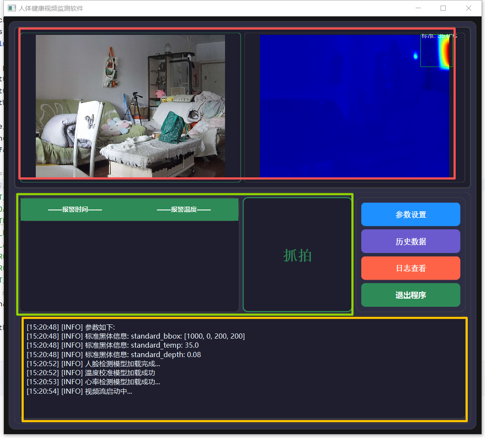
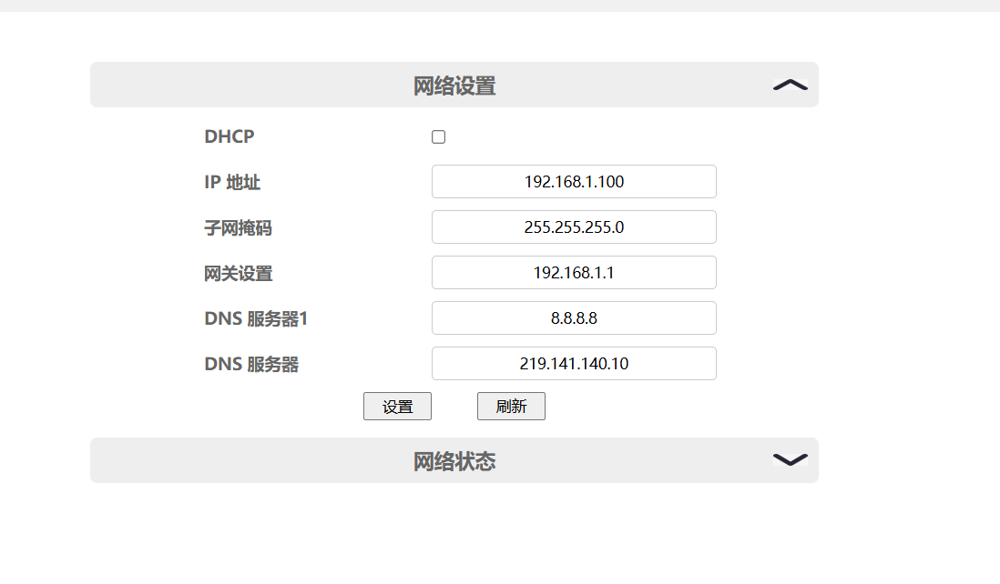
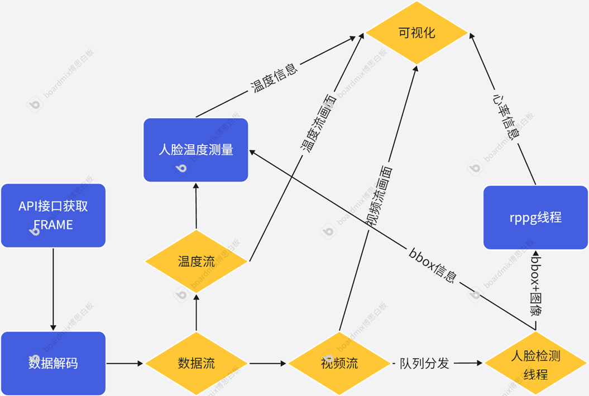
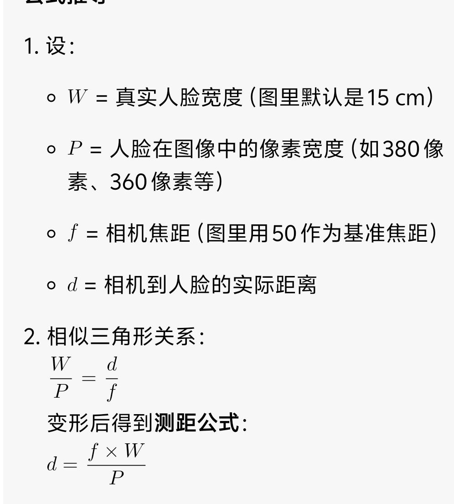

# 非接触人体生理信息检测

## 界面介绍
1、红色区域为可视化，左侧是RGB可见光相机的显示，右侧为温度流，温度流显示为RGB图像，蓝色区域为RPPG模块的显示。
2、绿色框中展示了报警抓拍的信息，左侧是报警的列表信息，包含了时间和温度，右侧则是最近一次抓拍的图片。
3、黄色区域则是日志显示的区域，主要展示了软件的打印信息
## 按钮信息

1、参数查看按钮:点击该按钮，打开参数设置页面。但是设置后config,yaml的注释将会消失，建议手动修改config.yaml即可。

2、历史数据按钮：点击该按钮，打开历史数据文件夹，可以查找温度报警的图像。

3、日志查看按钮：点击后可以查看产生的日志信息，也可以打开文件夹进行定期的清理日志信息。

4、退出程序按钮: 安全的退出所有进程和线程，并且关闭程序
## 相机环境部署
1、首先确认连接相机后是否还需要连接网络上网，
2、如果需要那么先输入命令，获取IP后记号
```commandline
linux
ip a 
windows
ipconfig  
192.168.1.40 这是我的IP 
```
3、 修改本机的IP，使之与相机在同一网关下(192.168.1.x 这是相机当前的IP),修改后通常计算机无法在访问网络。
~~~
关于相机IP，相机的出厂默认IP是192.168.0.100，只是因为我修改到我这边的IP了所以展示为192.168.1.x
~~~

4、登入浏览器设置相机的参数
~~~
浏览器访问地址http://192.168.0.100:8080 (针对本台相机，请自行修改为相机的实际IPhttp://192.168.1.100:8080 )
默认用户名admin，
默认密码admin
~~~
5、 相机管理页面设置


相机的IP 就设置为和刚才计算机IP一致的网关，就是最后的 . 之后的数字不同即可

同样的 网关设置也需要对应修改。

6、完成设置后，将主机网络该回去就可以连接相机了。

## 环境部署
本机环境使用的cuda11.8环境，运行环境为python3.12，cuda11.8环境

~~~
conda create -n pat python==3.12 -y
conda activate pat
pip install rtkb_sdk_python-1.0.1-py3-none-any.whl
pip install -r requirements.txt
git clone https://github.com/wanghongfei833/person_face_temp.git
cd person_face_temp
pip install -r requirements.txt -i http://mirrors.aliyun.com/pypi/simple/ --trusted-host mirrors.aliyun.com
~~~
## 权重下载

通过网盘分享的文件：非接触人体信号检测权重文件（人脸检测+提问检测+心率检测）.zip
链接: https://pan.baidu.com/s/12QLVvFhrLiRgHN-g2E3Stg 提取码: 8888 


解压密码 9527

## 根据config中的参数
描述进行对应权重路径修改
## 运行
~~~
python main.py
~~~
## 内部数据流展示


## 代码分布情况说明
[main.py](main.py) 作为函数的主入口信息，运行该文件即可启动程序。

[UI](UI) 目录下为GUI代码，用于显示程序运行界面。

[models](models) 目录下主要定义了各种模型（人脸跟踪模型、温度偏置模型、RPPG模型），其中黑体分割已弃用。

[utils](utils) 目录下主要定义了各种工具类，如数据流线程、人脸检测、温度校准、RPPG计算等。

其中qthread_xxx.py的作用则是进行几个多线程，通过Qthread线程进行模型的异步调用。

### 1、数据流线程[camera_stream.py](utils/camera_stream.py)
通过QThread进行无线循环的启用相机的回调函数，将对应的信息，如RGB图像和温度流矩阵推送出去，同时也会推送FPS信号，给RPPG使用

### 2、可见光视频流与温度流
可见光视频流通过队列发送后一份送给人脸检模块，一份送给可视化模块，同时其对应的FPS信息发送给RPPG模块。

温度流通过队列发送给温度校准模块。

### 人脸检测模块 [qthread_face_utils.py](utils/qthread_face_utils.py) + [track_face](models/track_face)
通过QThread进行人脸检测的启用，通过调用models中的人脸检测模型

将检测到的人脸信息推送给RPPG模块

将人脸检测框信息发送给可视化模块[display.py](utils/display.py)

将人脸检测框信息和距离信息发送给温度校准模块，其中人脸宽度计算公式如下：

### RPPG模块 [qthread_rppg.py](utils/qthread_rppg.py) + [rppg](models/rppg)
通过QThread进行RPPG的启用，通过调用models中的RPPG模型，利用[qthread_face_utils.py](utils/qthread_face_utils.py) 发送过来的人脸信息计算bvp。

使用[bvp2hr.py](utils/bvp2hr.py)计算出将RPPG，并且结果推送给可视化模块[display.py](utils/display.py)。

### 温度校准模块 [qthread_temp_utils.py](utils/qthread_temp_utils.py) + [temp_utils](models/temp_utils)

通过QThread进行温度校准的启用，通过调用models中的温度校准模型，利用深度信息与温度信息计算出温度偏置矩阵。

为避免温度突变或是异常信息的干扰，使用队列保存温度，并且利用[smooth_value.py](utils/smooth_value.py) 中的最小方差序列均值进行计算。
~~~
1、温度过滤，超过阈值温度的剔除
2、计算队列长度一半中 最小方差的数据，剔除异常数据
3、使用最小方差的数据取平均作为测量温度。
~~~
### 可视化模块 [display.py](utils/display.py)
1、通过定时刷新线程将视频流发送过来的RGB数据和温度数据可视化

2、异步接受 人脸检测中发送的检测框信息，温度流的 温度信息、rppg流的 bvp信息，并且整合后绘制到图层


