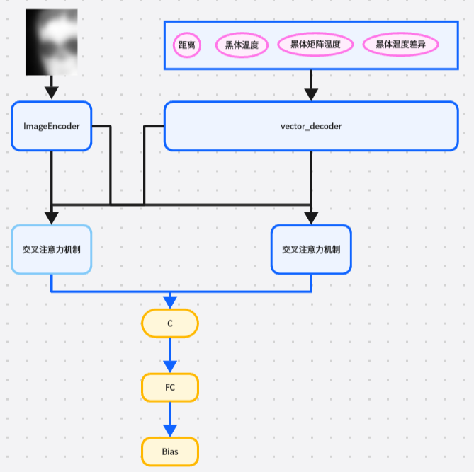

# 人脸温度校准模型的训练
## 模型结构示意图

## 数据采集
数据采集时，将相机的config的 FACE_TEMP 下的对应参数 data_collection 设置为Ture
~~~
data_collection = True
data_collection_path = "./data/face_temp" 
~~~
需要注意的是，一个文件夹下面必须要有相同的温度的人进行测量（不限制人数，但是人的提问必须一致），否则训练模型会失败。

同时 为保证数据质量，每次都必须在新文件夹中进行数据采集
## 训练模型
模型训练时 主要时修改数据路径，将每次采集的数据路径和对应的真实温度进行填写进去，假设采集了2次数据，第一次温度36.8 第二次39.2

~~~
python ./model_train/train_temp/train_temp_bias_model.py --image_dirs img1 img2 --true_list 36.8 39.2
~~~

## onnx 导出
~~~
python model_train/train_temp/export_model.py --weights best_model.pth
复杂导出，如果更换了模型之后，定义自己的参数
python model_train/train_temp/export_model.py --weights best_model.pth --input_shape 1 1 64 128   --feature_dim 4  --model_dims 128
~~~